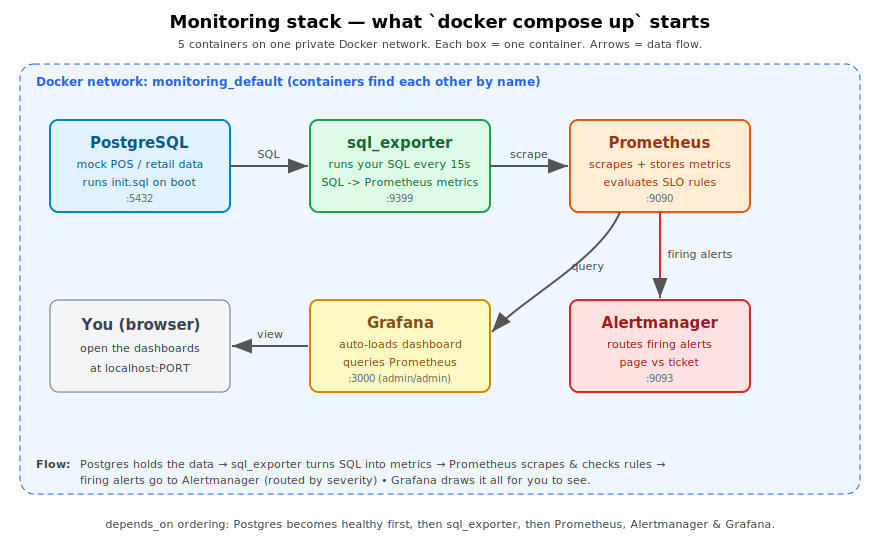

# CloudOps Proof-of-Work — Retail Platform Operations

[](../../actions/workflows/monitoring-ci.yml)
[](../../actions/workflows/security-ci.yml)

Working, runnable operations tooling for a **cloud-native, multi-cloud retail
platform** (Kubernetes / Helm across AWS, GCP, Azure — the CLOUD4RETAIL-style
stack). Built as practical proof of how I'd approach the day-to-day of a Cloud
Operations role: **monitoring, cost, security, and on-call reliability**.

> **Scope & honesty note.** This models *illustrative* patterns for a retail
> POS platform — it is **not** based on any company's internal architecture,
> which I don't have access to. Everything here runs; the CI badges above
> boot the monitoring stack on every push and assert that real metrics flow
> end to end (see [what CI proves](#what-ci-actually-proves)).

---

## Architecture



One `docker compose up -d` starts five containers on a private network:
Postgres holds mock POS data → **sql_exporter** turns operational SQL into
metrics → **Prometheus** scrapes them and evaluates SLO rules → firing alerts
route through **Alertmanager** by severity → **Grafana** draws it all.
Full walkthrough in [docs/ARCHITECTURE.md](docs/ARCHITECTURE.md).

---

## The four areas

| Folder | Operational problem it addresses | What's inside |
|---|---|---|
| **[monitoring/](monitoring/)** *(centerpiece)* | "Monitor with SQL queries + observability tooling" and a rotating on-call that shouldn't be woken for noise. | Full Prometheus + Grafana + Alertmanager stack, a **sql_exporter** turning operational SQL into metrics, and **SLO multi-window burn-rate alerts**. |
| **[cost/](cost/)** | Many customer instances across clouds quietly over-provisioned. | A **right-sizing analyzer**, **off-hours scaling** (the pattern behind my ~35% AWS saving at Aavas), and **KEDA** demand-driven autoscaling. |
| **[security/](security/)** | SaaS retail handles payment/PII; bad infra must never merge. | **Checkov policy gate** in CI catching real Terraform misconfigs, plus **External Secrets** pulling from AWS Secrets Manager. |
| **[reliability/](reliability/)** | On-call toil: the same manual triage at 3am. | A **self-healing runbook script** for crashloops, unschedulable pods, and stuck rollouts — read-only by default, `--apply` to act. |

---

## Quick start (monitoring centerpiece)

```bash
cd monitoring
docker compose up -d
# Grafana    http://localhost:3000  (admin/admin) -> "Retail Ops" dashboard
# Prometheus http://localhost:9090/alerts
# Alertmanager http://localhost:9093
```

The bundled mock POS database includes one deliberately stale store and a sync
backlog, so alerts and dashboards have real signal to show immediately.

```bash
# Cost analyzer (pure Python, no deps):
cd cost && python3 rightsizer.py --input sample_usage.json
```

---

## What CI actually proves

The `monitoring-stack-ci` workflow, on every push:
1. Validates the Prometheus config and SLO rules with `promtool`.
2. Boots the entire stack with `docker compose`.
3. Asserts the `sql_exporter` target is **up** in Prometheus.
4. Asserts the operational metrics (`pos_transactions_total`,
   `store_sync_lag_seconds`, `sync_queue_backlog`) are **flowing**.
5. Asserts the SLO recording rules **evaluate**.

It does **not** load-test alert firing or judge dashboard aesthetics — it
proves the stack boots and the wiring is correct, nothing more.

---

## Why these choices

- **SLO burn-rate alerting**, not static thresholds — pages only when the
  99.9% error budget is genuinely at risk, which is what keeps a rotating
  on-call sustainable.
- **SQL → Prometheus** via sql_exporter maps the role's "monitor with SQL"
  requirement onto a standard observability pipeline.
- **Cost work is backed by a real result** (~35% AWS reduction via off-hours
  scheduling), reproduced here as Kubernetes-native automation.
- **Security as a merge gate**, not an afterthought — the insecure fixture
  exists specifically to prove the gate catches it.
